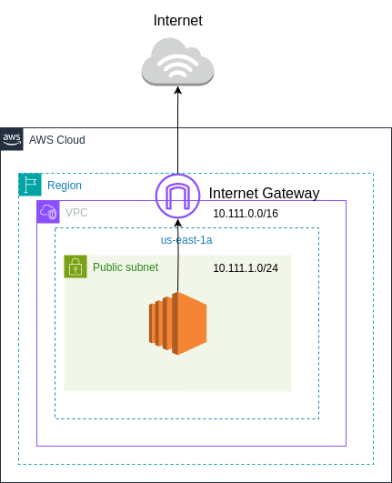
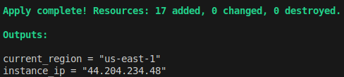
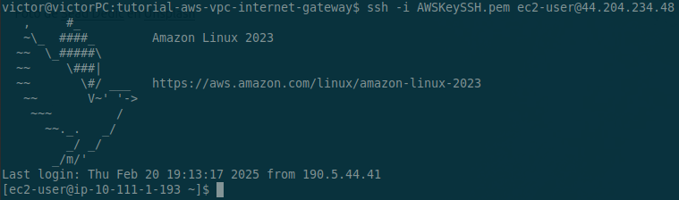

# Overview

The purpose of this lab is to create a basic VPC using Terraform. The infrastructure will consist of a VPC, a public subnet, an EC2 instance and an Internet Gateway attached to the VPC which will provide internet connectivity to our public subnet and therefore to our EC2 instance. We’ll also configure all necessary resources so you can SSH your instance. 



# Set up the AWS Provider
In order to create this infrastructure, we are going to use the AWS, Local and TLS providers. 

```
#Providers
terraform {
  required_version = "~> 1.10.2"
  required_providers {
    aws = {
      source  = "hashicorp/aws"
      version = "5.87.0"
    }
    local = {
      source  = "hashicorp/local"
      version = "2.5.2"
    }
    tls = {
      source  = "hashicorp/tls"
      version = "4.0.6"
    }
  }
}

#Configuring AWS Provider
provider "aws" {
  region = "us-east-1"
}
```

# Create a VPC and Subnet

We are going to create a custom VPC and public subnet to host our infrastructure.

```
#VPC 
resource "aws_vpc" "main" {
  cidr_block = "10.111.0.0/16"
}

#Subnet Public
resource "aws_subnet" "public_subnet" {
  vpc_id     = aws_vpc.main.id
  cidr_block = "10.111.1.0/24"
}
```

# Create an Internet Gateway
Create and place the Internet Gateway which will give our VPC access to the internet. 

```
#Internet Gateway
resource "aws_internet_gateway" "igw" {
  vpc_id = aws_vpc.main.id
}
```

# Route tables

We’ll create a route table "public_rtb" for our VPC. This table will route all traffic through the Internet Gateway. 
We also need to associate the route table with our public subnet. 

```
#Route Tables
#Public Route table
resource "aws_route_table" "public_rtb" {
  vpc_id = aws_vpc.main.id
  route {
    cidr_block = "0.0.0.0/0"
    gateway_id = aws_internet_gateway.igw.id
  }
}

#Create route table associations
#Associate public Subnet to public route table
resource "aws_route_table_association" "public" {
  subnet_id      = aws_subnet.public_subnet.id
  route_table_id = aws_route_table.public_rtb.id
}
```
# SSH Keys
The configuration below will create a local private key "AWSKeySSH.pem" and a public key "AWSKeySSH" which will be created on the AWS side. We’ll later associate this key pair with an EC2 instance. 

```
#SSH Config
#Create PEM File
resource "tls_private_key" "pkey" {
 algorithm = "RSA"
 rsa_bits  = 4096
}


resource "local_file" "private_key_pem" {
 content  = tls_private_key.pkey.private_key_pem
 filename = "AWSKeySSH.pem"
 file_permission = "0400"
}


#AWS SSH EC2 Key Pair | uses tls_private_key to generate public key
resource "aws_key_pair" "ec2_key" {
 key_name   = "AWSKeySSH"
 public_key = tls_private_key.pkey.public_key_openssh
  lifecycle {
   ignore_changes = [key_name] #to ensure it creates a different pair of keys each time
 }
}

```

# Security Groups
Now we need to create two security groups to allow ingress and egress traffic from our EC2 instance. We’ll start by creating the security group aws_security_group.web which will allow HTTP/HTTPS/ICMP ingress traffic and a default route to allow all egress traffic. I separated the security group aws_security_group.ssh which allows SSH traffic for security and reusability purposes. 

```
#Security Group - EC2
resource "aws_security_group" "web" {
 name        = "web"
 description = "allow web traffic"
 vpc_id      = aws_vpc.main.id
}
#Ingress rule for Security Group
resource "aws_vpc_security_group_ingress_rule" "allow_443" {
 security_group_id = aws_security_group.web.id
 cidr_ipv4         = "0.0.0.0/0"
 from_port         = 443
 to_port           = 443
 ip_protocol       = "tcp"
}
#Ingress rule for Security Group
resource "aws_vpc_security_group_ingress_rule" "allow_80" {
 security_group_id = aws_security_group.web.id
 cidr_ipv4         = "0.0.0.0/0"
 from_port         = 80
 to_port           = 80
 ip_protocol       = "tcp"
}
#Ingress rule for Security Group
resource "aws_vpc_security_group_ingress_rule" "allow_icmp" {
 security_group_id = aws_security_group.web.id
 cidr_ipv4         = "0.0.0.0/0"
 from_port         = -1
 to_port           = -1
 ip_protocol       = "icmp"
}
#Egress rule for Security Group
resource "aws_vpc_security_group_egress_rule" "egress_all" {
 security_group_id = aws_security_group.web.id
 cidr_ipv4         = "0.0.0.0/0"
 ip_protocol       = "-1"
}


#Security group to allow SSH
resource "aws_security_group" "ssh" {
 name        = "ssh"
 description = "allow SSH (for EC2 instance)"
 vpc_id      = aws_vpc.main.id
}


#Ingress rule for SSH
resource "aws_vpc_security_group_ingress_rule" "allow_ssh" {
 security_group_id = aws_security_group.ssh.id
 cidr_ipv4         = "0.0.0.0/0"
 from_port         = 22
 to_port           = 22
 ip_protocol       = "tcp"
}
#Egress rule for SSH
resource "aws_vpc_security_group_egress_rule" "egress_ssh_all" {
 security_group_id = aws_security_group.ssh.id
 cidr_ipv4         = "0.0.0.0/0"
 ip_protocol       = "-1"
}

```
# EC2 Instance
We can now create and place our EC2 instance in the public subnet. We need to associate to the instance the two security groups just created and the key pair. 

```
#EC2 Instances
resource "aws_instance" "amazon_linux" {
 ami                         = "ami-05576a079321f21f8"
 instance_type               = "t2.micro"
 security_groups             = [aws_security_group.web.id, aws_security_group.ssh.id]
 subnet_id                   = aws_subnet.public_subnet.id
 associate_public_ip_address = true
 key_name                    = aws_key_pair.ec2_key.key_name
}

```

# Apply Changes

On our local console we need to initialize our project, plan and apply. 

```
terraform init
terraform plan
terraform apply 
```

# Testing

You might have noticed that after applying, we printed the instance’s public IP on the console (check the outputs.tf file for the details). You can use this IP and the private key "AWSKeySSH.pem" to connect to the EC2 instance. 



You can use you favorite SSH client, but if you are on linux you can use this command:

```
ssh -i AWSKeySSH.pem ec2-user@YOUR-EC2-INSTANCE-IP
```



Congratulations! You are now connected to your EC2 instance.